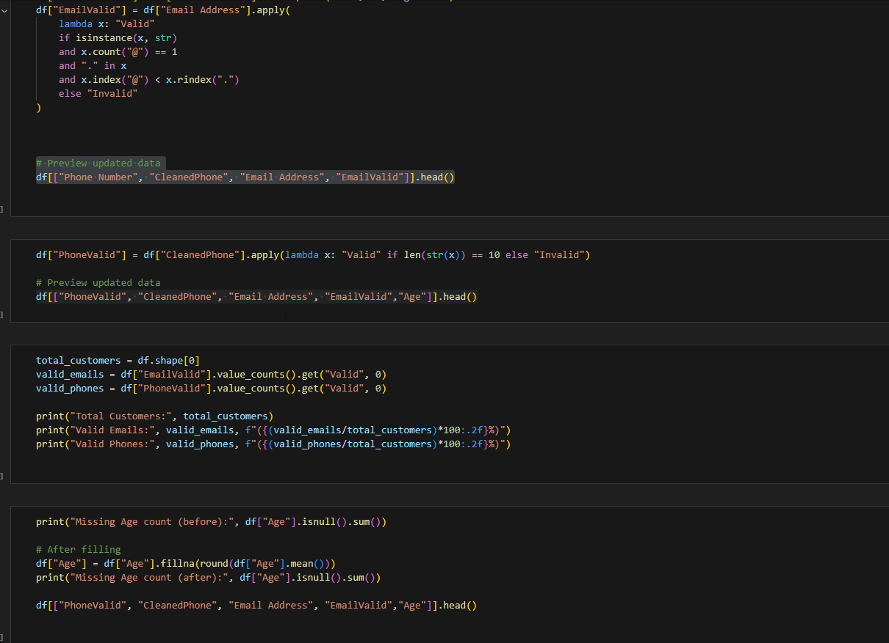

# Python Customer Data Cleaning Pipeline

This project demonstrates a real-world data engineering pipeline using Python and pandas.
We clean messy customer data including names, email addresses, phone numbers, and missing values.

## 📸 Sample Output Preview

## 🔧 Key Features:
- Cleaned inconsistent phone number formats using regex
- Validated email addresses with logic (no `@@`, no missing domains, one `@`)
- Removed special characters from name and address fields
- Handled missing age values by filling with mean
- Flagged valid/invalid phone and email entries
- Exported cleaned dataset for reporting or further use

## 📂 Dataset Columns:
- `CustomerName`
- `Email Address` ➤ validated
- `Phone Number` ➤ cleaned and validated
- `Address` ➤ cleaned
- `Age` ➤ filled if missing

## 💻 Tools Used:
- Python 3.x
- pandas
- Regex (`str.replace`, `.count`, `.index`)
- VS Code or Jupyter Notebook

## 🚀 Output:
- Cleaned customer dataset: `Python_CustomerData_Cleaned.csv`
- Summary insights printed to console

---

> ✅ This project showcases real-world data wrangling and validation logic — a key part of data engineering tasks before storing or analyzing customer data.

---
